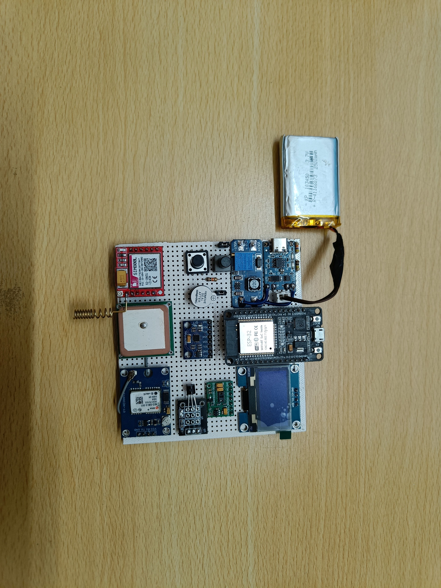

# 🛡️ Smart Silver Guardian – Elderly Safety & Health Monitoring System

## 📌 Project Overview

Smart Silver Guardian is an IoT-based wearable safety and health monitoring system designed to protect senior citizens and individuals living alone.

The system is developed in the form of a compact wearable band, allowing users to comfortably wear it throughout the day.

The device continuously monitors vital health parameters, physical movement, and location.

In emergency situations such as fall detection, abnormal health readings, or manual SOS activation, the system instantly sends alert notifications to predefined mobile numbers.

The solution uses GSM communication technology to ensure reliable operation in both urban and rural areas.

---

# 🎯 Usage

- Worn as a smart wearable safety band by elderly individuals
- Enables real-time health and activity monitoring
- Helps caregivers and family members track safety remotely
- Provides instant emergency alerts during critical conditions
- Suitable for home use, assisted living environments, and outdoor activities
- Lightweight, portable, and easy to operate

---

# ⚙️ Features

- Real-time health monitoring
- Emergency SMS alert system
- GPS location tracking
- Sensor-based wearable monitoring
- Continuous safety monitoring
- Portable and lightweight wearable design

---

# 📤 Output Plans

## 1️⃣ Emergency Alert Notification

- SMS alert sent to registered mobile numbers

### Triggered during:
- Fall detection
- Abnormal heart rate readings
- Low SpO₂ levels
- High body temperature
- SOS button press from the wearable band

---

## 2️⃣ Sensor Data Output

### Health parameters included in alert message:
- Heart rate
- Oxygen saturation (SpO₂)
- Body temperature

- Real-time data captured directly from wearable band sensors

---

## 3️⃣ Location Tracking Output

- GPS coordinates shared via SMS
- Google Maps link for easy navigation to the user's location

---

## 4️⃣ Continuous Monitoring Output

- Wearable band operates continuously in the background
- Automatically switches to alert mode when predefined thresholds are crossed

---

# 🛠️ Technologies Used

- Arduino IDE
- Embedded Systems
- IoT Technology
- GSM Module
- GPS Module
- Sensors
- Microcontroller Programming

---

# 📂 Files Included

- Project Source Code
- Circuit Diagram
- Project Images
- Documentation Files

---

# ✅ Expected Outcome

- Faster emergency response for wearable users
- Improved personal safety for senior citizens
- Increased confidence for family members and caregivers
- Reduced dependency on constant physical supervision
- Reliable alerts even without internet access

---

# 👨‍💻 Developed By

### Gopalakrishnan V

ECE Student | Embedded & IoT Enthusiast
